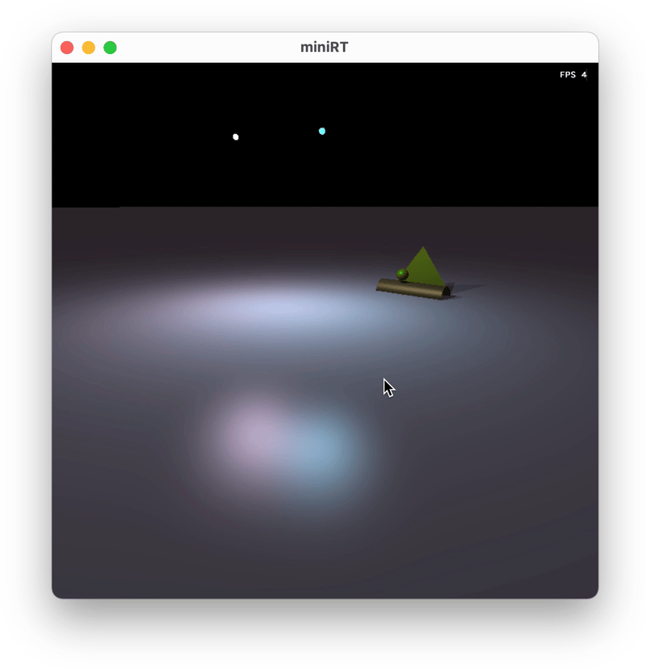
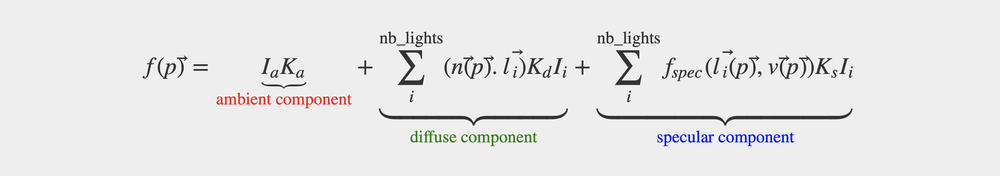
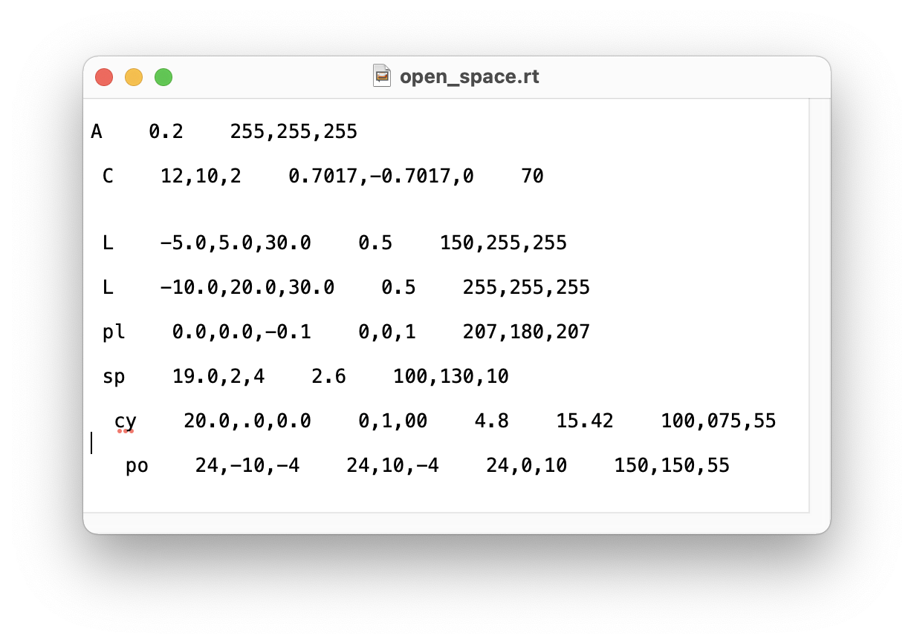
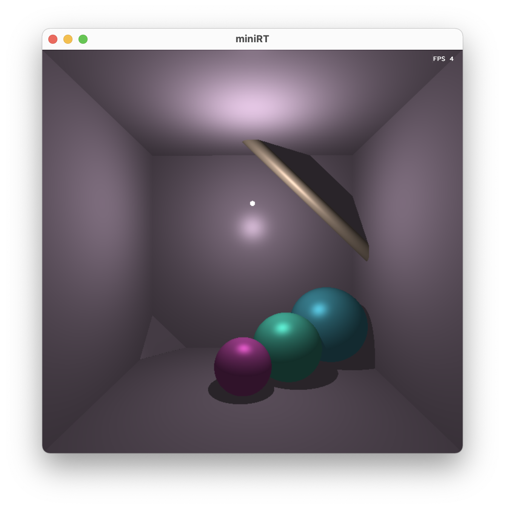
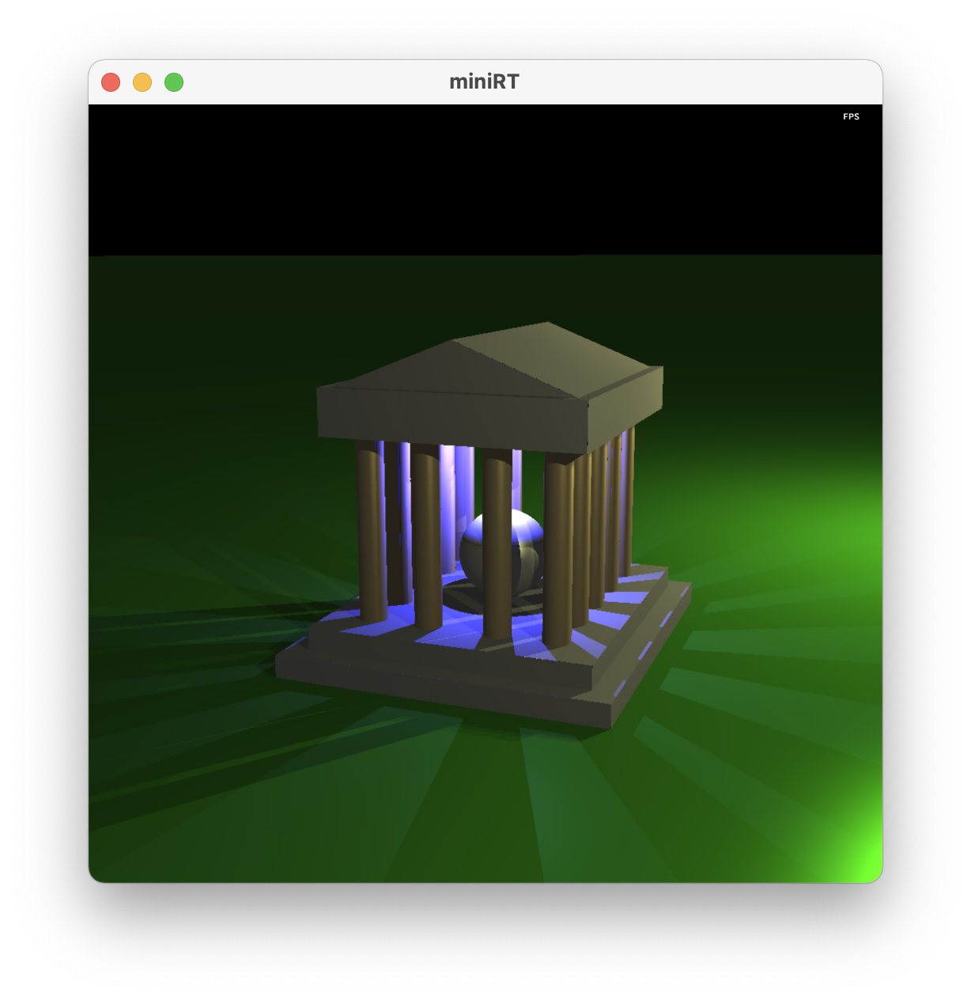
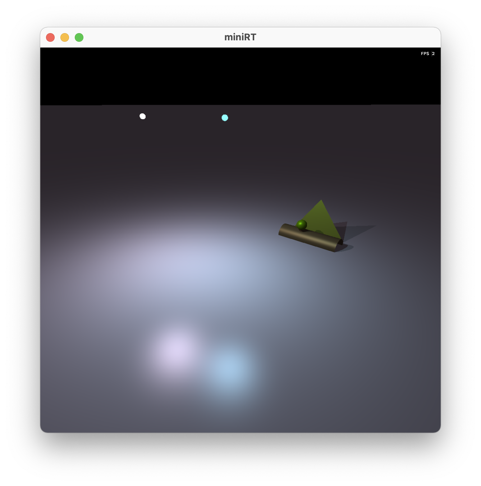

# **miniRT**

This project implements simplified cpu-driven raytracing engine which draws a configured scene according to Phong lighting model.
<br><br>



## **Phong model**
[Phong model](https://www.cs.utexas.edu/~bajaj/graphics2012/cs354/lectures/lect14.pdf) is a model which describes a brightness of particular point in the scene.




<br><br>

## **Algorithm**

Scene is redrawn with each iteration of main loop (mlx_loop_hook). Controls handling is running in separate thread (mlx_hook).
Diffuse and Specular components are drawn only if camera doesn't move due to intensive calculation of full Phong model.
<br><br>

## **Platform**
Mac OS (x86). Additional build options required to build Linux version of binary.
<br><br>

## **Instruments**
This project uses "**miniLibX** (libmlx)" API library to simplify working with **OpenGL** and **AppKit** in case of macOS and **X11** in case of Linux. 

Also **"libft"** self-written libc functions library is used due to educational subject restrictions.

Source files are lintered by "**42 Norminette**" linter.
<br><br>

## **Input**

At first scene configuration file must be formatted as *.rt. File contents represent different objects: "L" for light, "C" for camera, "A" for ambient lighting and "pl", "po", "sp", "cy" for plane, poligon, sphere and cylinder primitives respectively. All parameters must be separated by spaces. All objects must be separated by linebreaks.



**Ambient lighting (A)**

The first parameter is a ratio which is a float number in range of (0, 1). Second parameter is a 8-bit RGB color vector. Only one ambient light may present in the scene.

**Light source (L)**

The first parameter is a light source coordinates vector of floating point numbers. The rest two parameters are the same as in the ambient light configuration line.

**Camera (C)**

The first parameter is camera positon coordinates vector, the second one is normalized vector of the direction where camera is pointed. Third parameter is camera's angle of view in degrees. Only one camera may present in the scene.

**Plane (pl)**

The first component is a base point which belongs to the plane. The second component is normalized vector which is the normal vector to the plane's surface. The third component RGB color vector.

**Polygon (po)**

Poligon is simply a triangle. First three components are triange's peaks coordinates (float). The last parameter is triangle's color.

**Sphere (sp)**

The first parameter is sphere center coordinates, the second parameter is sphere diameter, the third parameter is color.

**Cylinder (cy)**

The first parameter is cylinder center (semi-height point), the second parameter is normalized cylinder axis direction vector, the third parameter is cylinder diameter. The fourth parameter is cylinder height. The fifth one is color.

<br><br>

## **Usage**

Building
```console
host@name:~$ make
host@name:~$
```
Launching
```console
host@name:~$ ./miniRT scenes/room.rt
host@name:~$
```
<br><br>


## **Features**

Full Phong lighting model is implemented (ambient + diffuse + specular).

"Free camera" mode is provided (keyboard (QWESAD) + mouse (left click)).

Camera view resets to default if R key is pressed.

Controls sensitivity can be adjusted by pressing "+" and "-" keys.

Plane, triange (polygon), sphere and cylinder primitives are supported.

Multiple light sources are supported.

Frames per second indicator is added.
<br><br>

## **Examples**

<br>





<br>
